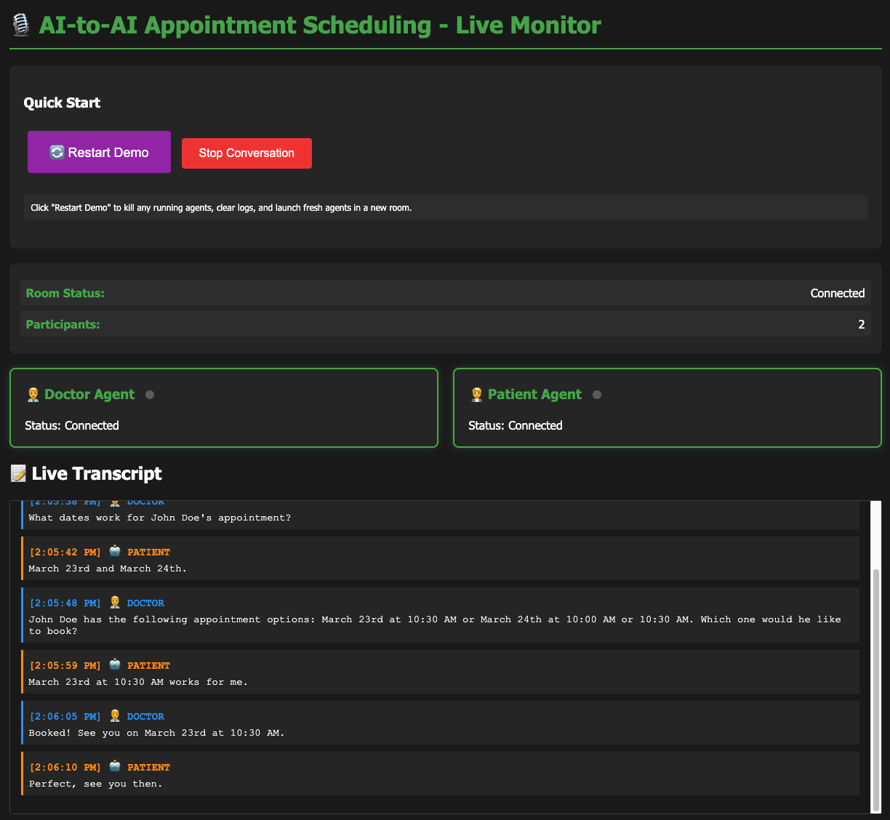

# AI-to-AI Voice Scheduling Demo

A proof-of-concept showing that two AI agents can complete a real-world task — booking a clinic appointment — using only spoken conversation, the same way two people would on a phone call.

<a href="demo.mp4"></a>
<br><sub>Click the image to watch the demo video.</sub>

## The Core Idea

Today, AI voice agents mostly handle one side of a phone call: an AI talks to a human. This demo asks: **what happens when both sides of the call are AI agents?**

The two agents in this demo — a Patient Agent and a Doctor Agent — have no shared memory, no inter-agent API, and no way to inspect each other's internal state. They communicate exactly the way humans do on the phone: one speaks, the other listens. That's it.

- The **Patient Agent** represents a person (John Doe) calling a clinic to book an appointment. It knows John's availability and wants a morning slot.
- The **Doctor Agent** represents a clinic receptionist. It has access to the clinic's appointment database and can look up open slots and confirm bookings.

Neither agent knows anything about the other's internals. The Patient Agent cannot see the clinic database. The Doctor Agent cannot see the patient's calendar. The only information exchange is the audio of their voices.

This models what a real deployment might look like: a patient-side AI dials the clinic's phone number, the clinic's AI picks up, and they negotiate an appointment — fully autonomously, no humans involved.

## How the Demo Works

1. Click **Restart Demo** in the web client
2. Both agents connect to a LiveKit room (standing in for a phone network)
3. The Patient Agent waits a moment, then speaks — like a caller waiting for someone to pick up
4. The Doctor Agent hears the greeting, understands it via STT, and responds
5. The agents take turns speaking and listening until a slot is agreed on
6. The Doctor Agent books the slot in its database and confirms verbally
7. The Patient Agent says goodbye and the conversation ends

The conversation is transcribed live in the browser, and you can hear both agents speak.

## Architecture

```
Browser (web_client.html)
  │  LiveKit JS SDK — subscribes to audio tracks from both agents
  │  SSE — streams live transcript from api_server.py
  ▼
api_server.py  (Flask, port 5001)
  │  Starts orchestrator_a2a.py
  │  Issues LiveKit access token for the browser (listen-only)
  │  Tails agent log files → SSE transcript stream
  ▼
orchestrator_a2a.py
  │  Creates a LiveKit room
  │  Spawns doctor_agent_a2a.py and patient_agent_a2a.py as subprocesses
  ▼
LiveKit Room  (WebRTC audio — stands in for a phone network)
  ├── doctor_agent_a2a.py   — listens, thinks, speaks
  └── patient_agent_a2a.py  — listens, thinks, speaks
```

### Per-Agent Pipeline

Each agent runs the same pipeline independently:

```
Incoming audio → STT (Deepgram) → LLM (Groq) → TTS (Deepgram) → Outgoing audio
                                      ↕
                               Tool calls (DB only, Doctor Agent)
```

- **VAD** (Silero) drives turn-taking: each agent detects when the other stops speaking and then responds. No fixed timers.
- Agents do **not** use any LiveKit presence or signalling features to coordinate — they only react to audio.

## Tech Stack

| Component | Technology |
|-----------|------------|
| Voice framework | livekit-agents SDK |
| Audio transport | LiveKit (WebRTC) |
| Doctor LLM | Groq `llama-3.3-70b-versatile` |
| Patient LLM | Groq `llama-3.1-8b-instant` |
| Speech-to-Text | Deepgram Nova-2 |
| Doctor voice | Deepgram `aura-asteria-en` |
| Patient voice | Deepgram `aura-athena-en` |
| Voice Activity Detection | Silero (`livekit-plugins-silero`) |
| Appointment database | Supabase (PostgreSQL) |
| Web client | Vanilla JS + LiveKit JS SDK |
| API / transcript server | Flask + SSE |

## Project Structure

```
tin_can/
├── doctor_agent_a2a.py       # Doctor AI agent (queries DB, books appointment)
├── patient_agent_a2a.py      # Patient AI agent (initiates the call)
├── orchestrator_a2a.py       # Creates LiveKit room, spawns both agents
├── api_server.py             # Flask API: restart, token generation, SSE transcript
├── web_client.html           # Browser UI: audio playback + live transcript
├── database_setup.sql        # Supabase schema and sample appointment slots
├── requirements.txt          # Python dependencies
├── setup.sh                  # One-time setup script
├── .env.example              # Environment variables template
└── logs/                     # Agent log files (auto-created)
    ├── doctor_agent_a2a_live.log
    └── patient_agent_a2a_live.log
```

## Prerequisites

- Python 3.11+
- [LiveKit account](https://livekit.io) — free tier works
- [Groq API key](https://groq.com) — free tier works
- [Deepgram API key](https://deepgram.com) — free tier works
- [Supabase project](https://supabase.com) — free tier works

## Installation

```bash
git clone <repo-url>
cd tin_can

python3 -m venv venv
source venv/bin/activate

pip install -r requirements.txt

cp .env.example .env
# edit .env with your credentials
```

## Configuration

```bash
# LiveKit
LIVEKIT_URL=wss://your-project.livekit.cloud
LIVEKIT_API_KEY=your_api_key
LIVEKIT_API_SECRET=your_api_secret

# Groq
GROQ_API_KEY=your_groq_api_key

# Deepgram
DEEPGRAM_API_KEY=your_deepgram_api_key

# Supabase
SUPABASE_URL=https://your-project.supabase.co
SUPABASE_KEY=your_supabase_anon_key
```

## Database Setup

1. Log in to [Supabase](https://supabase.com) and open your project's SQL Editor
2. Run the contents of `database_setup.sql`

This creates the `clinic_availability` table and seeds it with available morning slots for the coming weeks.

> **Note**: Supabase free-tier projects pause after inactivity. If DB queries fail with a connection error, go to supabase.com and click **Restore project**.

## Running the Demo

```bash
source venv/bin/activate
python api_server.py
```

Open **http://localhost:5001/web_client.html** and click **Restart Demo**.

## Agent Tools

### Doctor Agent
- `query_database(date)` — looks up available slots in `clinic_availability` for a given date
- `write_booking(date, time, patient_name)` — marks a slot as booked

### Patient Agent
No tool calls. The patient's availability is generated from the current date and injected into the system prompt at startup — simulating a patient-side calendar the agent has been given access to.

## Troubleshooting

| Symptom | Cause | Fix |
|---------|-------|-----|
| Modal closes but nothing happens | Agents failed to start | Check terminal output for Python errors |
| No audio in browser | Autoplay blocked | Click anywhere on the page; an "Enable Audio" button appears as fallback |
| DB queries return 0 slots | Sample data is stale | Re-run `database_setup.sql` to reseed with current dates |
| Connection error in DB queries | Supabase project paused | Restore at supabase.com |

## Customization

**Change voices** — edit the `tts = deepgram.TTS(model=...)` line in each agent file. Available Deepgram Aura voices: `aura-asteria-en`, `aura-athena-en`, `aura-luna-en`, `aura-stella-en`, `aura-hera-en`.

**Change LLM models** — edit the `groq.LLM(model=...)` line in each agent file.

**Change conversation behaviour** — edit `DOCTOR_SYSTEM_PROMPT` in `doctor_agent_a2a.py` or `PATIENT_SYSTEM_PROMPT` in `patient_agent_a2a.py`.

## License

MIT
